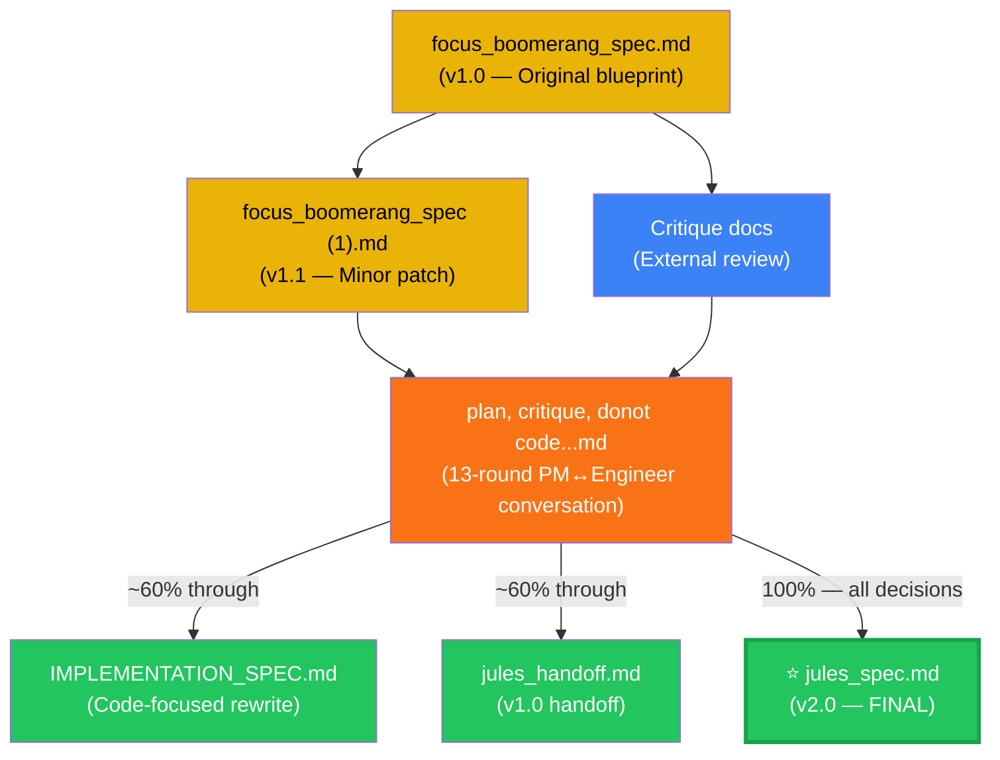

# Focus Boomerang — Spec File Comparison & Recommendation

> **Document Purpose:** A complete reference guide for understanding, comparing, and correctly using the 8 files generated during the Focus Boomerang product design process. Intended for the PM (you) and any coding agent working on this project.

---

## TL;DR — Which File to Give Your Coding Agent

> [!IMPORTANT]
> **Give your agent `focus_boomerang_jules_spec.md` (24,317 bytes) as the PRIMARY file.**
> It is the **most evolved, architecturally complete, and implementation-ready** document — the final output of the entire design conversation.
>
> If your agent supports supplementary context, also attach `focus_boomerang_spec (1).md` for its exhaustive bug catalogue and implementation guards.

---

## The 8 Files at a Glance

| # | Filename | Size | Role | Maturity |
|---|----------|------|------|----------|
| 1 | `focus_boomerang_spec.md` | 48,516 B | Original v1.0 product + engineering spec | 🟡 Foundation |
| 2 | `focus_boomerang_spec (1).md` | 48,847 B | v1.1 of the above — minor edits | 🟡 Foundation+ |
| 3 | `Critique of the Focus Boomerang...md` | 18,186 B | External critique of file #1 | 🔵 Review doc |
| 4 | `focus boomerang - read and reply _ critique.md` | 10,114 B | Condensed critique + action items | 🔵 Review doc |
| 5 | `plan ,critique , donot code...md` | 102,424 B | Full PM ↔ Engineer design conversation | 🟠 Process log |
| 6 | `focus_boomerang_jules_handoff.md` | 22,359 B | First Jules-ready handoff (v1.0) | 🟢 Implementation |
| 7 | **`focus_boomerang_jules_spec.md`** | **24,317 B** | **Final Jules spec (v2.0)** | **🟢🟢 Best** |
| 8 | `IMPLEMENTATION_SPEC.md` | 23,929 B | Implementation-focused rewrite | 🟢 Implementation |

---

## Evolution Timeline (How These Files Relate)



**Read the graph:** The design conversation (File 5) was the crucible. Everything before it fed in; only one file truly absorbed all of its decisions — `jules_spec.md`. Files 6 and 8 were both written at the ~60% mark of that conversation, so they're missing the evolved feature set.

---

## Detailed File-by-File Analysis

---

### 1. `focus_boomerang_spec.md` — The Original Blueprint (v1.0)

- **What it is:** The first complete product + engineering specification. Written before any critique or design conversation.
- **Strengths:**
  - Comprehensive problem framing
  - MV3-aware Manifest V3 architecture
  - Pre-coded bug catalogue (8 bugs documented upfront)
  - Implementation guards (8 rules)
  - Known limitations section
  - Phase 2 scope defined and deferred cleanly
- **Weaknesses:**
  - Missing `boomerangArmed` from storage schema — it is *used* in section 14 but never *defined* in the schema table
  - No consolidated `manifest.json` JSON block (just description)
  - No boomerang execution sequence (no numbered order of checks)
  - Neutral domain behavior left undefined — treated ambiguously
  - Only `gemini_complete` signal exists; `gemini_started` is absent (critical for ghost boomerang prevention)
  - Two-level MutationObserver described conceptually but without formal contracts
- **Verdict:** Excellent *design document* but **not implementation-ready** for a coding agent. Use as historical reference, not instructions.

---

### 2. `focus_boomerang_spec (1).md` — Patched Original (v1.1)

- **What it is:** Same as #1 with minor corrections (331 bytes difference — roughly a paragraph of edits).
- **Strengths:** Everything from #1 plus the most **exhaustive bug catalogue and implementation guards** across all 8 files. The known-bugs section is more detailed here than anywhere else.
- **Weaknesses:** Same structural gaps as #1 — all the missing features from the design conversation are absent.
- **Best Use:** As a **supplementary reference** alongside `jules_spec.md`. Specifically, cross-reference Section 16 (bugs) and Section 18 (guards) when writing `background.js` and `content.js`.
- **Verdict:** Best *engineering reference document* for bugs/guards, but still not implementation-ready on its own.

---

### 3. `Critique of the Focus Boomerang...md` — External Audit

- **What it is:** A 10-point external critique of file #1, written by a reviewer auditing the spec for gaps.
- **Strengths:**
  - Identified `boomerangArmed` schema omission
  - Raised localization/i18n risk (hardcoded English strings in UI)
  - Flagged notification click behavior gap (what happens when you click the Chrome notification?)
  - MutationObserver performance concern raised (polling vs. observer tradeoffs)
- **Weaknesses:** Review-only document — no implementation guidance, no code contracts, no schema fixes.
- **Verdict:** 🚫 **Never give this to a coding agent.** It's feedback on a spec, not a spec itself. It identifies problems without solving them. All issues it raises are resolved in `jules_spec.md`.

---

### 4. `focus boomerang - read and reply _ critique.md` — Condensed Critique

- **What it is:** A shorter, more actionable version of #3, tightened for quick reading with explicit "Fix:" suggestions after each issue.
- **Strengths:** Same key issues as #3 in a tighter format. Good for a PM scanning what needs to be addressed.
- **Weaknesses:** Still review-only — it's critique, not spec. The "Fix:" suggestions are directional, not prescriptive enough for code.
- **Verdict:** 🚫 **Same as #3 — not for coding agents.** Useful only if you want a quick reminder of what was wrong with v1.0 before the conversation fixed it.

---

### 5. `plan ,critique , donot code...md` — The Full Design Conversation (102 KB)

- **What it is:** The complete PM ↔ Lead Engineer design conversation spanning ~13 rounds, from the initial prompt through all critiques, decisions, debates, and final resolutions. This is the **primary source of truth** for *why* decisions were made.
- **Strengths — unique content found ONLY here:**
  - Every single decision with its rationale (the "why" that other files strip out)
  - **Three-tier system (Study / Rabbit Hole / Distraction)** — first introduced here, not in any other file except `jules_spec.md`
  - Rabbit hole escalation logic — the exact triggers: 5-dismiss cycle **and** 5-minute overstay
  - Parent context tab concept (`lastStudyTabId` / `lastStudyWindowId`)
  - `isGenerating` guard against ghost boomerangs
  - `WINDOW_ID_NONE` debounce fix with the exact 150ms value
  - Chrome Memory Saver / discarded tab handling discussion
  - Session object shape definition (full fields debated and decided)
  - Full URL-level classification with 6-month expiry rationale
  - Permanent whitelist concept (YouTube Music, hello.iitk.ac.in as examples)
  - Classification prompt UX decision (slim floating bar, not a modal)
  - Overlay design decision (full blur, auto-pause video, single "Go Back" button — not a toast)
  - The deliberate decision to NOT use `*://*/*` in host_permissions and why
- **Weaknesses:**
  - **102 KB of raw conversation** — an AI agent would drown in noise, contradictions, and superseded decisions
  - No consolidated spec section — decisions are scattered across 13 rounds
  - Contains superseded decisions that were corrected in later rounds (a coding agent can't tell which version is current)
  - The "Answer skipped" at the very end means the promised "most detailed .md file ever" was **never actually written** — `jules_spec.md` is the closest thing to it
- **Verdict:** 🚫 **Do NOT give this raw to a coding agent.** It's the richest source of truth for *you* (the PM), but an agent needs consolidated, unambiguous instructions. This is the archaeological record; `jules_spec.md` is the finished artifact.

---

### 6. `focus_boomerang_jules_handoff.md` — First Handoff (v1.0)

- **What it is:** The first attempt at a clean, agent-ready implementation spec. Written at approximately the 60% mark of the design conversation.
- **Strengths:**
  - Clean `manifest.json` with rationale comments
  - Complete storage schema formatted as a table (types, defaults, ownership)
  - Step-by-step event handler logic
  - Boomerang execution sequence defined with numbered steps
  - Domain matching algorithm made explicit (`exact || endsWith('.' + stored)`)
- **Weaknesses (all caused by being written before the conversation completed):**
  - **Missing:** Three-tier classification system — only Study/Distraction, no Rabbit Hole tier
  - **Missing:** Rabbit hole escalation logic (5-dismiss + 5-min triggers)
  - **Missing:** `isGenerating` guard (ghost boomerangs possible)
  - **Missing:** Parent context tab tracking
  - **Missing:** Overlay design (no blur, no auto-pause, no "Go Back")
  - Neutral domains treated as "Study" (Option A) — this was the pre-conversation decision; the product evolved significantly afterward
- **Verdict:** Usable but **outdated** — represents the spec state ~60% through the design conversation. Do not use as primary input.

---

### 7. `focus_boomerang_jules_spec.md` — Final Spec (v2.0) ⭐ THE ONE TO USE

- **What it is:** The most evolved implementation specification, written after the full design conversation concluded, incorporating all decisions across all 13 rounds.
- **What it gets right (full feature checklist):**
  - ✅ Three-tier tab classification: **Study / Rabbit Hole / Distraction**
  - ✅ Rabbit hole escalation with **both** triggers: 5-dismiss cycle + 5-min overstay
  - ✅ `isGenerating` flag as ghost boomerang guard
  - ✅ Parent context tab tracking (`lastStudyTabId` / `lastStudyWindowId`)
  - ✅ Full-screen blur overlay with auto-pause video
  - ✅ Complete `manifest.json` JSON block (copy-pasteable)
  - ✅ Complete storage schema with types, defaults, and ownership column
  - ✅ Two-level MutationObserver strategy with formal contracts (not just description)
  - ✅ `gemini_started` + `gemini_complete` dual signal system
  - ✅ Boomerang execution sequence with numbered step order
  - ✅ Domain matching: `exact || endsWith('.' + stored)` (RFC-correct, handles subdomains)
  - ✅ `WINDOW_ID_NONE` edge case handling (150ms debounce)
  - ✅ Notification throttle (`lastNotifiedAt` in storage)
  - ✅ Onboarding flow included
  - ✅ Session object shape defined
  - ✅ Classification prompt UX specified (slim floating bar, not modal)
  - ✅ Permanent whitelist + 6-month URL expiry
  - ✅ Phase 2 scope deferred list
- **Weaknesses:**
  - Does **not** include the exhaustive pre-coded bug catalogue from files #1/#2 (8 bugs + 8 guards) — these still need to be cross-referenced from `spec (1).md`
  - Slightly shorter on "why" rationale — decisions are present but reasoning is condensed
  - Missing `host_permissions: *://*/*` — only has `gemini.google.com` — **see the critical warning below**
- **Verdict:** ✅ **This is the file to give your coding agent.** It represents the final, most architecturally complete state of the product.

---

### 8. `IMPLEMENTATION_SPEC.md` — Implementation-Focused Rewrite

- **What it is:** A code-oriented rewrite of the spec, designed to make it easy for an agent to translate directly into code (more pseudo-code style, less prose).
- **Strengths:**
  - Very clean structure optimized for code generation
  - Complete `manifest.json` block
  - Storage schema formatted as a code block
  - Explicit permission rationale for each permission
  - Includes `*://*/*` in host_permissions (needed for URL reading) — ironically more correct on this one point than `jules_spec.md`
- **Weaknesses (same root cause as File 6 — written at the ~60% mark):**
  - **Missing:** Three-tier classification — only Study/Distraction
  - **Missing:** Rabbit hole escalation
  - **Missing:** Overlay design (blur + auto-pause)
  - **Missing:** Parent context tab tracking
  - **Missing:** `isGenerating` guard
- **Verdict:** Clean formatting, but **outdated product vision** — missing 40%+ of the finalized feature set. The code structure is good; the product it describes is incomplete.

---

## Head-to-Head: The Two Contenders

The real choice is between `focus_boomerang_jules_spec.md` (v2.0) and `focus_boomerang_spec (1).md` (v1.1). Here is every feature dimension compared:

| Feature / Decision | `jules_spec.md` (v2.0) | `spec (1).md` (v1.1) |
|---|:---:|:---:|
| Three-tier classification (Study/Rabbit Hole/Distraction) | ✅ | ❌ (two-tier only) |
| Rabbit hole escalation logic | ✅ | ❌ |
| `isGenerating` guard (ghost boomerang prevention) | ✅ | ❌ |
| `gemini_started` signal | ✅ | ❌ |
| Parent context tab tracking | ✅ | ❌ |
| Overlay: full blur + auto-pause video | ✅ | ❌ |
| Onboarding flow | ✅ | ❌ |
| Session object shape defined | ✅ | ❌ |
| Classification prompt UX specified | ✅ | ❌ |
| URL-level persistence + 6-month expiry | ✅ | ❌ |
| Permanent whitelist concept | ✅ | ❌ |
| Chrome Memory Saver / discarded tab guard | Partial | ❌ |
| Pre-coded bug catalogue (8 bugs) | ❌ | ✅ |
| Implementation guards (8 rules) | Partial | ✅ |
| Known limitations section | ❌ | ✅ |
| Phase 2 scope deferred list | ✅ | ✅ |
| Complete `manifest.json` JSON block | ✅ | ❌ |
| Boomerang execution sequence (numbered) | ✅ | ❌ |
| Two-level MutationObserver contract | ✅ | ✅ (conceptual only) |
| `*://*/*` host permission | ❌ | ✅ |

> [!TIP]
> **`jules_spec.md` wins on 13 out of 19 feature dimensions.** It captures the full, evolved product designed over 13 rounds of PM ↔ Engineer discussion. `spec (1).md` is the more exhaustive *engineering reference document* but describes a significantly simpler product — the 2-tier version, not the 3-tier version.

---

## Final Recommendation

### Strategy: Primary + Supplement

**Step 1 — PRIMARY:** Give `focus_boomerang_jules_spec.md` to your coding agent.
- This is the canonical source of truth for *what to build*
- Contains all finalized decisions, schemas, and execution sequences
- Represents the full, evolved product vision

**Step 2 — SUPPLEMENT:** Also provide `focus_boomerang_spec (1).md` as a reference document.
- Tell your agent: *"This supplementary doc contains a detailed bug catalogue (Section 16) and implementation guards (Section 18). Cross-reference these when coding `background.js` and `content.js`. Do not use the feature descriptions from this file — use only the PRIMARY file for that."*

**Step 3 — DO NOT GIVE** the other 6 files to a coding agent:
- Files 3 & 4: Critique documents — they describe problems, not solutions
- File 5: Raw conversation log — 102 KB of noise with superseded decisions scattered throughout
- File 6: Outdated handoff — missing 40%+ of the feature set
- File 8: Outdated rewrite — same maturity as File 6, different format

---

## Critical Gap to Fix Before Handoff

> [!WARNING]
> **One gap to fix before handoff:** `focus_boomerang_jules_spec.md` only has:
> ```json
> "host_permissions": ["*://gemini.google.com/*"]
> ```
> But the boomerang logic needs to read the URL of **any** active tab to classify it as Study / Rabbit Hole / Distraction. Without `"*://*/*"` in `host_permissions`, `chrome.tabs.query` returns tabs with **redacted URLs** (the URL field becomes an empty string).
>
> **Fix options — choose one:**
> 1. Add `"*://*/*"` to the `host_permissions` array in `focus_boomerang_jules_spec.md` before giving it to your agent
> 2. Tell your agent explicitly: *"Add `*://*/*` to host_permissions in the manifest. The spec omits this but it is required for URL classification to work."*
>
> **Why it was omitted:** The design conversation had a deliberate discussion about minimal permissions for user trust. The consensus was to try `"*://*/*"` and see if the Chrome Web Store review team flags it. It was a known tradeoff, not an oversight. Decide which side of that tradeoff you want before handoff.

---

## Additional Notes for the PM

### What the Design Conversation (File 5) Resolved That No Other File Captures

If you ever need to revisit a decision, these are the conclusions that live *only* in the conversation log and `jules_spec.md`:

| Decision | Conclusion | Where in conversation |
|---|---|---|
| Two-tier vs. three-tier classification | Three-tier: Study / Rabbit Hole / Distraction | Round 7 |
| Rabbit hole escalation triggers | 5-dismiss cycle **OR** 5-min overstay (either trigger is sufficient) | Round 8 |
| Neutral domain default behavior | Classified as Rabbit Hole (not Study, not Distraction) | Round 8 |
| Ghost boomerang prevention | `isGenerating` flag in storage; boomerang fires only when `isGenerating = false` | Round 9 |
| Overlay design | Full-screen blur, auto-pause video, single "Go Back" button (not a toast, not a modal, not a banner) | Round 10 |
| URL vs. domain persistence | Both: domain-level for whitelist/blacklist, URL-level for classification cache with 6-month expiry | Round 11 |
| Permanent whitelist concept | Yes — certain domains (YouTube Music, study portals) never trigger boomerang regardless of session | Round 11 |
| Classification UX | Slim floating bar at top of page (not a modal, not a tab) | Round 12 |
| `WINDOW_ID_NONE` handling | 150ms debounce before acting on focus loss events | Round 6 |
| MutationObserver strategy | Two-level: page-level observer for DOM structure + subtree observer for Gemini response container | Round 5 |

### What Still Needs Design Work (Phase 2)

The following features were explicitly deferred to Phase 2 in the conversation and are **not spec'd** in any current file:

- Cross-device session sync (what happens when you switch from laptop to phone mid-session?)
- Team/shared mode (shared focus sessions, accountability partner feature)
- AI-assisted classification improvement (feeding back user corrections to improve the classifier)
- Pomodoro integration (timer-aware boomerang behavior)
- Streak and gamification system (mentioned but not designed)
- Analytics dashboard (session history, distraction patterns)

---

## Glossary of Key Terms (For Agent Context)

| Term | Definition |
|---|---|
| **Boomerang** | The core mechanism: when you leave your study tab for a distraction, the extension brings you back |
| **Study tab** | A tab classified as Study — the anchor point the boomerang returns you to |
| **Rabbit Hole** | A tab that started neutral/borderline but crossed escalation thresholds — treated as distraction |
| **Distraction** | A tab explicitly classified as off-task (social media, entertainment, etc.) |
| **Ghost boomerang** | A boomerang that fires incorrectly when Gemini is still generating (prevented by `isGenerating` flag) |
| **`isGenerating`** | Storage flag set to `true` when Gemini starts generating, `false` when complete — guards against ghost boomerangs |
| **`lastStudyTabId`** | Storage field tracking the tab ID of the most recent Study-classified active tab |
| **`lastStudyWindowId`** | Storage field tracking the window ID of the most recent Study-classified active tab |
| **`boomerangArmed`** | Storage flag: `true` when the extension is actively monitoring for distraction; `false` when session is paused/ended |
| **`gemini_started`** | Message sent from content script to background when Gemini begins generating a response |
| **`gemini_complete`** | Message sent from content script to background when Gemini finishes generating a response |
| **`WINDOW_ID_NONE`** | Chrome constant (-1) returned by `chrome.windows.onFocusChanged` when Chrome loses focus to another app — must be debounced (150ms) before acting |
| **Two-level observer** | MutationObserver strategy: outer observer watches for Gemini's response container to appear in DOM; inner observer watches the container's content for streaming completion |
| **Permanent whitelist** | Domains that never trigger boomerang regardless of session state (e.g., YouTube Music for lo-fi studying) |
| **URL-level cache** | Per-URL classification stored in `chrome.storage.local` with 6-month expiry, to avoid re-classifying the same page repeatedly |

---

*Document generated: April 2026. Reflects the full Focus Boomerang design conversation as of its conclusion.*
